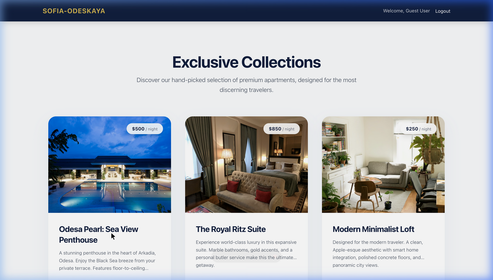
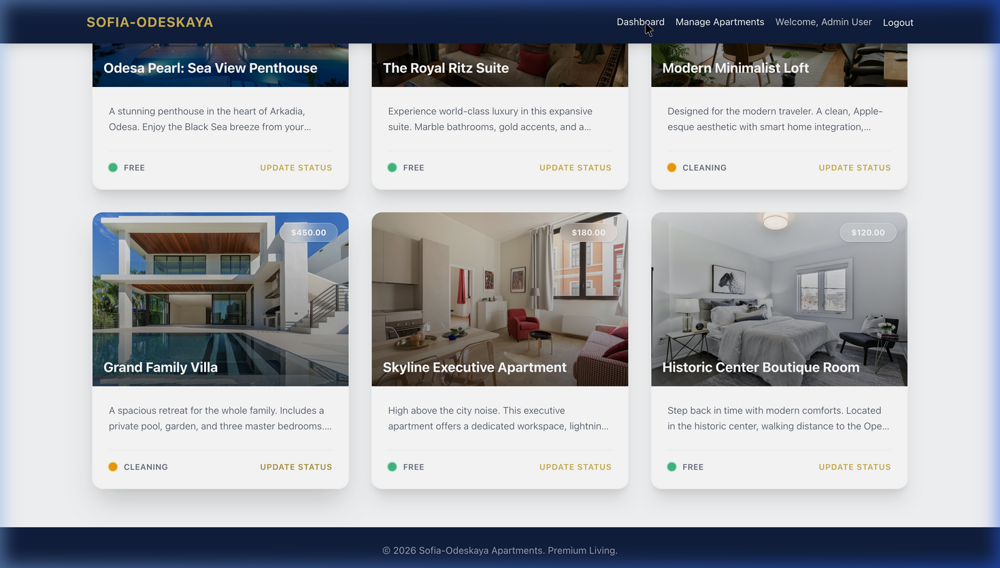
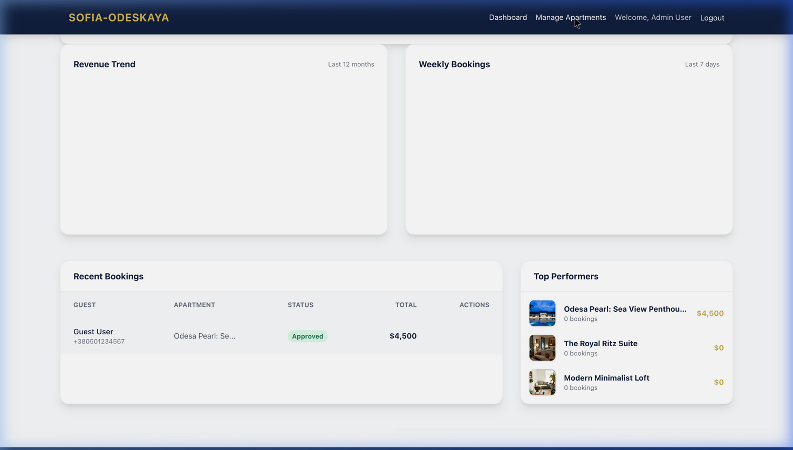

<div align="center">
  
  
  <h1> Sofia-Odeskaya Apartments</h1>
  <p><strong>Преміальна система управління бронюванням апартаментів та бутик-готелів</strong></p>

  <p>
    <a href="https://sofia-odeskaya-apartments-production.up.railway.app/" target="_blank">
        
    </a>
  </p>

  <p>
    
    
    
    
  </p>
</div>

---

## 🟢 Працюючий Проект (Live Demo)

Ви можете переглянути повністю працюючу версію проекту онлайн:
👉 **[Перейти на сайт Sofia-Odeskaya (Railway Production)](https://sofia-odeskaya-apartments-production.up.railway.app/)**

**Тестові дані для входу на живий сайт:**
- **Адмін:** `admin@sofa.com` / `password`
- **Гість:** `guest@sofa.com` / `password`

---

## 📖 Огляд проекту

**Sofia-Odeskaya Apartments** — це повнофункціональна, готова до виробництва платформа управління бронюванням, створена для розкішних апартаментів та бутик-готелів. Вона забезпечує бездоганний та витончений досвід як для гостей, що планують свій відпочинок, так і для адміністраторів, які керують нерухомістю та доходами.

Побудований на базі **Laravel, Livewire 3 та Tailwind CSS**, додаток гарантує миттєву взаємодію у стилі SPA без необхідності написання складних фронтенд-рішень на JavaScript.

---

## ✨ Можливості

### 🤵 Для Шановних Гостей
*   **Захоплюючий Каталог:** Переглядайте розкішні апартаменти у галереях з високою роздільною здатністю та бездоганним відображенням зображень.
*   **Бронювання у Реальному Часі:** Миттєво надсилайте запити через адаптивний, зручно закріплений віджет бронювання.
*   **Щирі Відгуки:** Читайте детальні, верифіковані відгуки та оцінки від попередніх гостей.
*   **Безпечна Авторизація:** Надійний процес реєстрації, входу та зручне управління профілем користувача.

### 🛡️ Для Адміністраторів
*   **Панель Керівника:** Отримуйте вичерпну аналітику, включаючи дохід з початку місяця, рівень заповнюваності та інтерактивні графіки (Дохід проти Бронювань).
*   **Експорт Доходів:** Створення елегантно відформатованих CSV-звітів для фінансового моніторингу в один клік.
*   **Управління Фондом:** Додавайте нові об'єкти, змінюйте статуси апартаментів (Вільний, Зайнятий, Прибирання) та керуйте місткістю в режимі реального часу.
*   **Обробка Запитів:** Переглядайте, схвалюйте або відхиляйте нові заявки на бронювання без жодних зусиль.

---

## 🎨 Галерея

<details>
<summary><b>🔥 Натисніть, щоб переглянути скріншоти додатка</b></summary>

### Інтерфейс Гостя та Каталог
*Елегантний гостьовий інтерфейс для перегляду та бронювання.*
<br/>

<br/><br/>


### Панель Адміністратора та Керування
*Вичерпна панель управління для адміністраторів.*
<br/>

<br/><br/>


</details>

---

## 🚀 Технологічний Стек

- **Фреймворк:** Laravel 11.x
- **Фронтенд:** Livewire 3 + Alpine.js
- **Стилізація:** Vanilla CSS + Tailwind CSS
- **База Даних:** SQLite (стандартна для швидкого розгортання)
- **Графіки:** Chart.js

---

## 💻 Встановлення та Налаштування

Запуск проекту у локальному середовищі відбувається надзвичайно швидко.

### Передумови
- PHP 8.2+
- Composer
- Node.js та NPM

### Покрокова Інструкція

1. **Клонуйте репозиторій**
   ```bash
   git clone https://github.com/yourusername/sofia-odeskaya.git
   cd sofia-odeskaya
   ```

2. **Встановіть залежності PHP**
   ```bash
   composer install
   ```

3. **Встановіть залежності NPM**
   ```bash
   npm install
   npm run build
   ```

4. **Налаштуйте середовище**
   ```bash
   cp .env.example .env
   php artisan key:generate
   ```

5. **Налаштування Бази Даних та Наповнення**
   *Ця команда створює базу даних SQLite та наповнює її демонстраційними апартаментами, користувачами, відгуками та бронюваннями.*
   ```bash
   php artisan migrate:fresh --seed
   ```

6. **Запустіть Додаток**
   ```bash
   php artisan serve
   ```
   *Відкрийте `http://localhost:8000` у вашому браузері.*

---

## 🔑 Стандартні Доступи

Після виконання команди наповнення бази (`php artisan migrate:fresh --seed`), ви можете увійти, використовуючи наступні тестові облікові записи:

**Доступ Адміністратора**
*   **Email:** `admin@sofa.com`
*   **Пароль:** `password`
*   *Примітка: Після входу вас буде автоматично перенаправлено до Панелі Керівника.*

**Доступ Гостя**
*   **Email:** `guest@sofa.com`
*   **Пароль:** `password`

---


